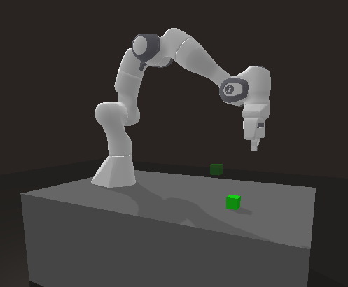

# gym-panda

## Introduction
Support [Stable-Baseline3](https://github.com/DLR-RM/stable-baselines3) and [LeRobot](https://github.com/huggingface/lerobot).

## Installation

```bash
git clone https://github.com/jia-xinyu/gym-panda.git
cd gym-panda && pip install -e .
```

## Usage

Run the demo file
```bash
python demo.py
```

<div align="center">

</div>

## References

* [panda-gym](https://github.com/qgallouedec/panda-gym)
